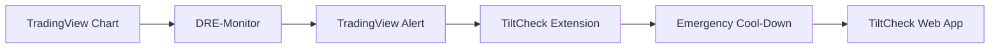

TiltCheck + DRE-Monitor

> **A behavioral circuit breaker for traders who are serious about protecting their capital from themselves.**

Stop revenge trading before it destroys your account.

**DRE-Monitor** detects emotional risk on TradingView.

**TiltCheck** interrupts execution by forcing a cool-down before you can place another trade.

Together they create a behavioral circuit breaker between impulse and execution.

---

## 🎥 Demo

### 🌐 Live Demo

https://tiltcheck-app.vercel.app

### 📺 Demo Video

https://youtu.be/JjMKinj2t3Y?si=48l2cXh9zn_3aVnG


---


## 📸 Screenshots

### Home Dashboard


### Pre-Trade Checklist


### Trade Journal


### Weekly Summary


### Emergency Cool-Down


### Analytics


### TradingView Extension


---

## ✨ Features

- 🧠 Pre-Trade Discipline Checklist
- 📒 Emotional Trade Journal
- 📊 Weekly Discipline Summary
- 🚨 Emergency Cool-Down Button
- 📉 DRE-Monitor TradingView Indicator
- 🔒 Behavioral Circuit Breaker
- 🌐 Browser Extension
- 🔓 Open Source
- 🔐 Privacy First
- 🚫 Zero Analytics
- 🚫 Zero Tracking
- 🚫 No Backend

---

# The Problem

Every blown trading account follows a familiar pattern.

One losing trade becomes two.

Two become five.

Then comes revenge trading.

Most traders already know they should stop.

The problem isn't knowledge.

It's biology.

After a significant loss, stress hormones reduce rational decision-making and increase impulsive behavior. At that moment you're no longer following your trading plan—you are reacting emotionally.

Most trading software helps you analyze charts.

**TiltCheck helps you analyze yourself.**

---

# The Solution

TiltCheck combines two independent components into a single behavioral safety system.

| Layer | Purpose | Trigger |
|-------|---------|---------|
| **DRE-Monitor** | Detects emotional risk using drawdown and consecutive adverse bars. | Risk threshold reached |
| **TiltCheck Extension** | Blocks impulsive trading with a mandatory cool-down. | Manual activation or DRE alert |

**DRE-Monitor is the sensor.**

**TiltCheck is the lock.**

Together they create a simple feedback loop:

**Detect → Interrupt → Recover → Return with a clear mind**

---

# Why This Matters

Alerts are easy to ignore.

Willpower disappears under stress.

TiltCheck bridges the gap between recognizing emotional danger and preventing impulsive execution.

Instead of relying on discipline, the system temporarily removes the ability to keep clicking.

---

# 🏗 Architecture



---

# 🚀 Getting Started

## 1. Install DRE-Monitor

1. Open TradingView.
2. Open the Pine Editor.
3. Copy `RiskExhaustionMonitor.pine`.
4. Paste it into the editor.
5. Click **Add to Chart**.
6. Configure your thresholds.
7. Create a TradingView Alert.

Suggested defaults:

- Moving Average: 21
- Consecutive Adverse Bars: 3
- Maximum Drawdown: 3%

---

## 2. Install TiltCheck Extension

1. Clone or download this repository.
2. Open Chrome.
3. Visit:

```text
chrome://extensions
```

4. Enable **Developer Mode**.
5. Click **Load unpacked**.
6. Select the `tiltcheck-extension` folder.
7. Open TradingView, DexScreener or Pump.fun.
8. Click the **Emergency Cool-Down** button whenever you need to step away.

---

# 🔒 Privacy

TiltCheck follows a **zero-trust, zero-telemetry** philosophy.

- No analytics
- No cookies
- No cloud backend
- No accounts
- No personal information collected
- No trading data transmitted

Everything runs locally.

---

# 🧠 Technical Details

## DRE-Monitor

Tracks:

- Peak-to-trough drawdown
- Consecutive adverse bars

Uses `barstate.isconfirmed` to avoid repainting.

## TiltCheck Extension

Uses a `MutationObserver` to survive modern SPA websites and automatically re-injects the Emergency Cool-Down button.

---

# 🛣 Roadmap

## Version 1

- [x] Browser Extension
- [x] DRE-Monitor
- [x] Trade Journal
- [x] Weekly Summary
- [x] Pre-Trade Checklist

## Planned

- [ ] Chrome Web Store
- [ ] Firefox Extension
- [ ] Better Analytics
- [ ] Custom Lock Durations
- [ ] Telegram Notifications
- [ ] Export Journal
- [ ] Mobile Companion

---

# ❤️ Why Open Source?

Trading psychology tools should be transparent.

Inspect every line of code before installing.

No hidden tracking.

No hidden telemetry.

---

# 🤝 Contributing

Issues, feature requests and pull requests are welcome.

If TiltCheck helped you avoid even one revenge trade, consider leaving the repository a ⭐.

---

# 📄 License

MIT License

Trade smart.

Stay disciplined. 🛡️
